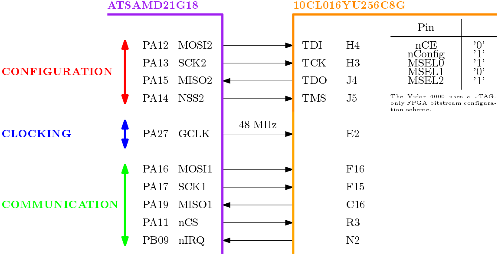

107-Arduino-Viper-FPGA
======================
[](https://travis-ci.org/107-systems/107-Arduino-Viper-FPGA)

This repository contains the VHDL code and Arduino library for the MKR VIDOR 4000 FPGA powering the Viper quadcopter.

## `extras`
### `extras/rtl`
This directory contains the Register-Transfer-Level VHDL code intended to be to synthesized for the MKR VIDOR 4000 FPGA. In order to analyse the VHDL code and run testbenches [GHDL](http://ghdl.free.fr/) needs to be installed after which it can be invoked via `make`.
```bash
sudo apt-get install ghdl gtkwave
cd rtl
make all
```

### `extras/syn`
This directory contains the [Quartus Version 19.1.0 Build 670 09/22/2019 SJ Lite Edition](https://fpgasoftware.intel.com/?edition=lite) synthesis project for generating the FPGA configuration file for the Cyclone 10 FPGA (*10CL016YU256C8G*) mounted on the MKR VIDOR 4000.

## MCU/FPGA System Architecture
The FPGA is configured via JTAG and can be clocked by the exact same clock as the MCU (48 MHz). The original MKR Vidor 4000 core performs the communication with the FPGA via bit-banging the JTAG interface (which is slow). To overcome this limitation the communication between MCU and FPGA in the Viper Quadcopter shall be implemented using the other available SPI interface. The MCU is the master while the FPGA is the slave. Events can be communicated by the FPGA to the MCU by producing a falling edge on the nIRQ pin.

