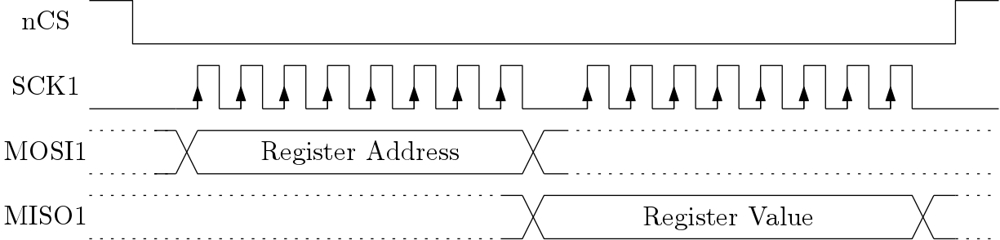

107-Arduino-Viper-FPGA
======================
[](https://travis-ci.org/107-systems/107-Arduino-Viper-FPGA)

This repository contains the VHDL code and Arduino library for the MKR VIDOR 4000 FPGA powering the Viper quadcopter.

## `examples`
This folder contains examples which demonstrate how to use the Arduino library to interface with the FPGA.

## `extras`
### `extras/rtl`
This directory contains the Register-Transfer-Level VHDL code intended to be to synthesized for the MKR VIDOR 4000 FPGA. In order to analyse the VHDL code and run testbenches [GHDL](http://ghdl.free.fr/) needs to be installed after which it can be invoked via `make`.
```bash
sudo apt-get install ghdl gtkwave
cd rtl
make all
```

### `extras/syn`
This directory contains the [Quartus Version 19.1.0 Build 670 09/22/2019 SJ Lite Edition](https://fpgasoftware.intel.com/?edition=lite) synthesis project for generating the FPGA configuration file for the Cyclone 10 FPGA (*10CL016YU256C8G*) mounted on the MKR VIDOR 4000.

## `src`
This directory contains the Arduino library for interfacing with the FPGA.

## MCU/FPGA System Architecture
The FPGA is configured via JTAG and can be clocked by the exact same clock as the MCU (48 MHz). The original MKR Vidor 4000 core performs the communication with the FPGA via bit-banging the JTAG interface (which is slow). To overcome this limitation the communication between MCU and FPGA in the Viper Quadcopter shall be implemented using the other available SPI interface. The MCU is the master while the FPGA is the slave. Events can be communicated by the FPGA to the MCU by producing a falling edge on the nIRQ pin.


### MCU/FPGA SPI Interface
The following graphics show how to access the FPGA configuration and control registers from the MCU.

**Read**



**Write**


## SPI Register Interface
### Register Overview

| Address | Register                  | Description                                  |
|:-------:|:-------------------------:|:--------------------------------------------:|
| 0x00    | `FPGA_REV_NUM`            | FPGA revision number                         |
| 0x01    | `RGB_LED_RED_INTENSITY`   | Control the `red` intensity of the RGB LED   |
| 0x02    | `RGB_LED_GREEN_INTENSITY` | Control the `green` intensity of the RGB LED |
| 0x03    | `RGB_LED_BLUE_INTENSITY`  | Control the `blue` intensity of the RGB LED  |

### Register Description
#### [0x00] FPGA_REV_NUM
This register holds the FPGA revision number which indicates which version of the RTL code was used to synthesize the FPGA configuration file and therefore gives an indication which capabilities exist within the FPGA.

| Bit   | 7              | 6              | 5              | 4              | 3              | 2              | 1              | 0              |
|:-----:|:--------------:|:--------------:|:--------------:|:--------------:|:--------------:|:--------------:|:--------------:|:--------------:|
|       | **REV_NUM_7**  | **REV_NUM_6**  | **REV_NUM_5**  | **REV_NUM_4**  | **REV_NUM_3**  | **REV_NUM_2**  | **REV_NUM_1**  | **REV_NUM_0**  |
|Access | R              | R              | R              | R              | R              | R              | R              | R              |
|Reset  | -              | -              | -              | -              | -              | -              | -              | -              |

#### [0x01] RGB_LED_RED_INTENSITY
This register is used to control the intensity/brightness of the **red** LED of the RGB LED located on the Vidor Camera Adapter board.

| Bit   | 7       | 6       | 5       | 4       | 3       | 2       | 1       | 0       |
|:-----:|:-------:|:-------:|:-------:|:-------:|:-------:|:-------:|:-------:|:-------:|
|       | **R7**  | **R6**  | **R5**  | **R4**  | **R3**  | **R2**  | **R1**  | **R0**  |
|Access | R/W     | R/W     | R/W     | R/W     | R/W     | R/W     | R/W     | R/W     |
|Reset  | 0       | 0       | 0       | 0       | 0       | 0       | 0       | 0       |

| R/G/B[7:0] | LED PWM Duty Cycle |
|:----------:|:------------------:|
| 0          | 0 %                |
| 127        | 50 %               |
| 255        | 100 %              |

#### [0x02] RGB_LED_GREEN_INTENSITY
This register is used to control the intensity/brightness of the **green** LED of the RGB LED located on the Vidor Camera Adapter board.

| Bit   | 7       | 6       | 5       | 4       | 3       | 2       | 1       | 0       |
|:-----:|:-------:|:-------:|:-------:|:-------:|:-------:|:-------:|:-------:|:-------:|
|       | **G7**  | **G6**  | **G5**  | **G4**  | **G3**  | **G2**  | **G1**  | **G0**  |
|Access | R/W     | R/W     | R/W     | R/W     | R/W     | R/W     | R/W     | R/W     |
|Reset  | 0       | 0       | 0       | 0       | 0       | 0       | 0       | 0       |

#### [0x03] RGB_LED_BLUE_INTENSITY
This register is used to control the intensity/brightness of the **blue** LED of the RGB LED located on the Vidor Camera Adapter board.

| Bit   | 7       | 6       | 5       | 4       | 3       | 2       | 1       | 0       |
|:-----:|:-------:|:-------:|:-------:|:-------:|:-------:|:-------:|:-------:|:-------:|
|       | **B7**  | **B6**  | **B5**  | **B4**  | **B3**  | **B2**  | **B1**  | **B0**  |
|Access | R/W     | R/W     | R/W     | R/W     | R/W     | R/W     | R/W     | R/W     |
|Reset  | 0       | 0       | 0       | 0       | 0       | 0       | 0       | 0       |
