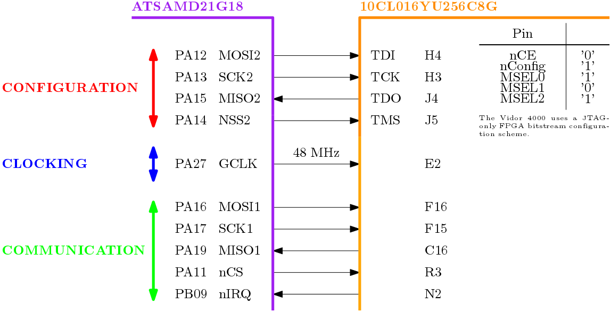
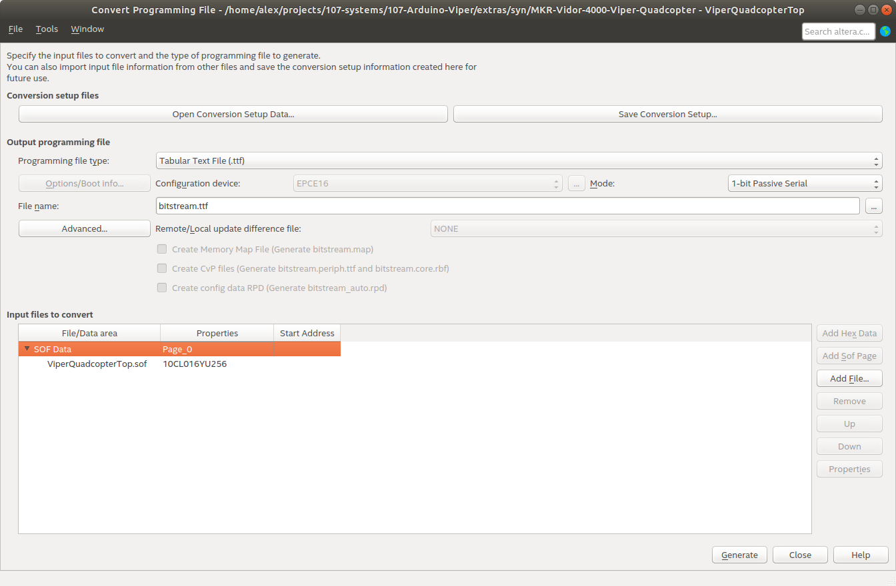
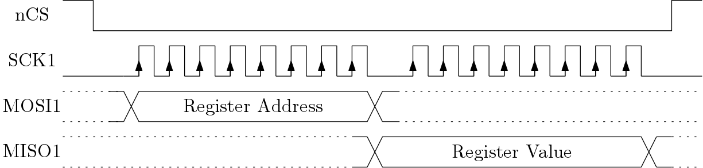
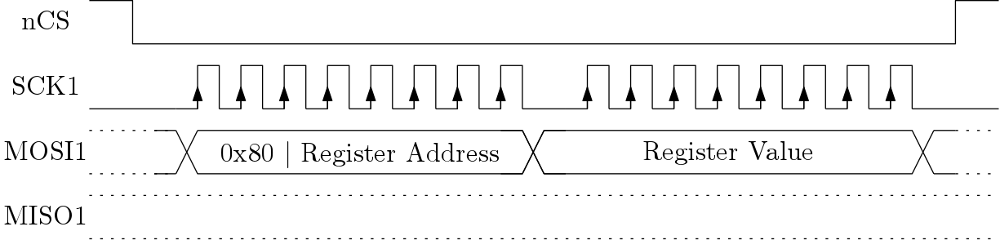

`ArduinoViperFpga`
==================

## MCU/FPGA System Architecture
The FPGA is configured via JTAG and can be clocked by the exact same clock as the MCU (48 MHz). The original MKR Vidor 4000 core performs the communication with the FPGA via bit-banging the JTAG interface (which is slow). To overcome this limitation the communication between MCU and FPGA in the Viper Quadcopter shall be implemented using the other available SPI interface. The MCU is the master while the FPGA is the slave. Events can be communicated by the FPGA to the MCU by producing a falling edge on the nIRQ pin.

<p align="center">

</p>

### How-to-upload custom FPGA bitstream + sketch
#### Generate `bitstream.ttf`
The bitstream itself is provided as a [Tabular Text File](https://www.intel.com/content/www/us/en/programmable/quartushelp/13.0/mergedProjects/reference/glossary/def_ttf.htm) (*.ttf) which can be generated via Quartus after successful synthesis using the following steps:

1) Perform synthesis run
2) Menu **File -> Convert Programming File**
3) Menu **Programming File Type** -> Select **Tabular Text File (.ttf)**
4) Menu **File name:** -> Set to **bitstream.ttf**
5) Menu **Input files to convert** -> Select **SOF Data** -> Left-click **Add File** -> Select **syn/output/ViperQuadcopterTop.sof**
6) Generate `bitstream.ttf` via left-click on **Generate**
7) Copy `bitstream.ttf` to `src/Fpga/bitstream.ttf`



The bitstream is included into the compiled firmware binary by enforcing its placement at a specially declared section `.fpga_bitstream` which is declared to start at `0x0004 0000` which is
```C++
__attribute__ ((used, section(".fpga_bitstream")))
uint8_t const bitstream[] = {
  #include "bitstream.ttf"
};
```
`.fpga_bitstream` is declared to start at `0x0004 0000` which is at the very end of the ATSAMD21G18 flash space.
```C
MEMORY
{
  FLASH_FPGA (r) : ORIGIN = 0x00040000, LENGTH = 0x00200000
  FLASH (rx) : ORIGIN = 0x00000000+0x2000, LENGTH = 0x00040000-0x2000 /* First 8KB used by bootloader */
/* ... */
.fpga_bitstream_section :
{
    KEEP(*(.fpga_bitstream_signature))
    KEEP(*(.fpga_bitstream))
} > FLASH_FPGA
```

#### Generate `bitstream_signature.h`
The bitstream signature is used by the bootloader to determine which address the FPGA configuration should be loaded too as well to verify whether or not the the FPGA image needs to be updated at all. The structure of the bitstream signature looks like this:
```C++
typedef struct
{
  uint32_t offset;
  uint32_t length;
  uint32_t sha256sum[8];
  uint32_t type;
  uint32_t force;
} Signature;
```
and for each `bitstream.ttf` a corresponding `bitstream_signature.h` (example below) has to be created and copied to `src/Fpga/bitstream_signature.h`. The bitstream signature is included into the firmware binary in a similar way to the bitstream itself, that is via special linker section:
```C
__attribute__ ((used, section(".fpga_bitstream_signature")))
const unsigned char signatures[4096] = {
  NO_BOOTLOADER,
  #include "bitstream_signature.h"
  NO_USER_DATA,
};
```
Example of a `bitstream_signature.h`:
```C++
0x00, 0x00, 0x08, 0x00, /* offset */
0x44, 0x7f, 0x06, 0x00, /* length */
0x0a, 0x00, 0x9c, 0x99, 0x80, 0x3d, 0xa4, 0xb4, 0x03, 0x14, 0x60, 0x97, 0xdd, 0x03, 0x20, 0x01, 0xd8, 0x81, 0x5b, 0x23, 0x49, 0xb4, 0x2a, 0xe1, 0xfc, 0xa6, 0xfb, 0x9f, 0xb6, 0xb0, 0xe5, 0x4d, /* sha256sum */
0x01, 0x00, 0x00, 0x00, /* type */
0x00, 0x00, 0x00, 0x00, /* force flag, change to 1 if needed */
```

### MCU/FPGA SPI Interface
The following graphics show how to access the FPGA configuration and control registers from the MCU.

**Read**

<p align="center">

</p>

**Write**

<p align="center">

</p>

## SPI Register Interface
### Register Overview

| Address | Register                  | Description                                  |
|:-------:|:-------------------------:|:--------------------------------------------:|
| 0x00    | `FPGA_REV_NUM`            | FPGA revision number                         |
| 0x01    | `RGB_LED_RED_INTENSITY`   | Control the `red` intensity of the RGB LED   |
| 0x02    | `RGB_LED_GREEN_INTENSITY` | Control the `green` intensity of the RGB LED |
| 0x03    | `RGB_LED_BLUE_INTENSITY`  | Control the `blue` intensity of the RGB LED  |

### Register Description
#### [0x00] FPGA_REV_NUM
This register holds the FPGA revision number which indicates which version of the RTL code was used to synthesize the FPGA configuration file and therefore gives an indication which capabilities exist within the FPGA.

| Bit   | 7              | 6              | 5              | 4              | 3              | 2              | 1              | 0              |
|:-----:|:--------------:|:--------------:|:--------------:|:--------------:|:--------------:|:--------------:|:--------------:|:--------------:|
|       | **REV_NUM_7**  | **REV_NUM_6**  | **REV_NUM_5**  | **REV_NUM_4**  | **REV_NUM_3**  | **REV_NUM_2**  | **REV_NUM_1**  | **REV_NUM_0**  |
|Access | R              | R              | R              | R              | R              | R              | R              | R              |
|Reset  | -              | -              | -              | -              | -              | -              | -              | -              |

#### [0x01] RGB_LED_RED_INTENSITY
This register is used to control the intensity/brightness of the **red** LED of the RGB LED located on the Vidor Camera Adapter board.

| Bit   | 7       | 6       | 5       | 4       | 3       | 2       | 1       | 0       |
|:-----:|:-------:|:-------:|:-------:|:-------:|:-------:|:-------:|:-------:|:-------:|
|       | **R7**  | **R6**  | **R5**  | **R4**  | **R3**  | **R2**  | **R1**  | **R0**  |
|Access | R/W     | R/W     | R/W     | R/W     | R/W     | R/W     | R/W     | R/W     |
|Reset  | 0       | 0       | 0       | 0       | 0       | 0       | 0       | 0       |

| R/G/B[7:0] | LED PWM Duty Cycle |
|:----------:|:------------------:|
| 0          | 0 %                |
| 127        | 50 %               |
| 255        | 100 %              |

#### [0x02] RGB_LED_GREEN_INTENSITY
This register is used to control the intensity/brightness of the **green** LED of the RGB LED located on the Vidor Camera Adapter board.

| Bit   | 7       | 6       | 5       | 4       | 3       | 2       | 1       | 0       |
|:-----:|:-------:|:-------:|:-------:|:-------:|:-------:|:-------:|:-------:|:-------:|
|       | **G7**  | **G6**  | **G5**  | **G4**  | **G3**  | **G2**  | **G1**  | **G0**  |
|Access | R/W     | R/W     | R/W     | R/W     | R/W     | R/W     | R/W     | R/W     |
|Reset  | 0       | 0       | 0       | 0       | 0       | 0       | 0       | 0       |

#### [0x03] RGB_LED_BLUE_INTENSITY
This register is used to control the intensity/brightness of the **blue** LED of the RGB LED located on the Vidor Camera Adapter board.

| Bit   | 7       | 6       | 5       | 4       | 3       | 2       | 1       | 0       |
|:-----:|:-------:|:-------:|:-------:|:-------:|:-------:|:-------:|:-------:|:-------:|
|       | **B7**  | **B6**  | **B5**  | **B4**  | **B3**  | **B2**  | **B1**  | **B0**  |
|Access | R/W     | R/W     | R/W     | R/W     | R/W     | R/W     | R/W     | R/W     |
|Reset  | 0       | 0       | 0       | 0       | 0       | 0       | 0       | 0       |
